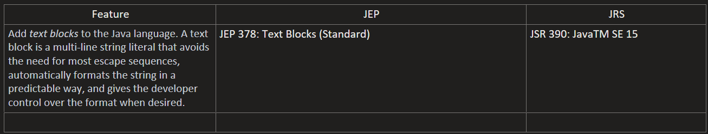
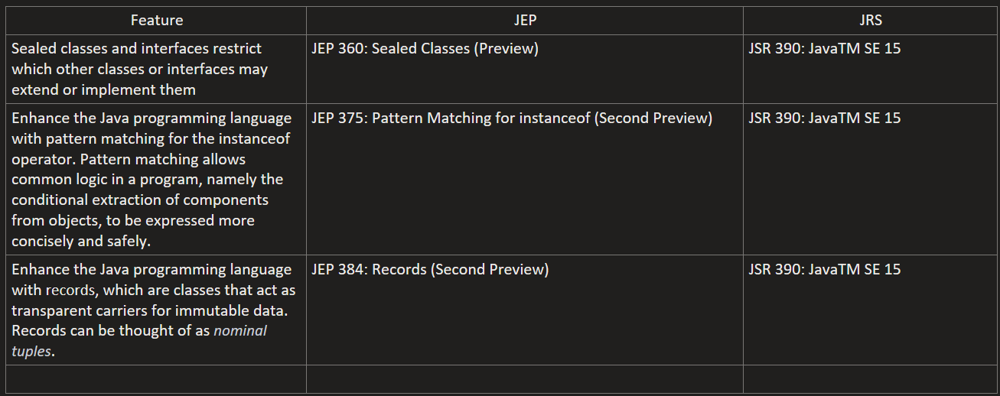

# java-15-features
## New Features

## New Preview Features

## Settings in IntelliJ IDEA to use "Preview" features with Java 15
#### Settings > Build, Execution, Deployment > Compiler > Java Compiler :
- #### Project bytecode version: 15
- #### Per-module bytecode version:
    - #### Module: java-15-features
    - #### Target bytecode version: 15
- #### Javac Options:
    - #### Additional command line parameters: --enable-preview
#### Run/Debug Configurations > Application > [Choose Application] :
- #### Build and Run > Modify Options > Add VM Options :
    - #### VM Options: --enable-preview